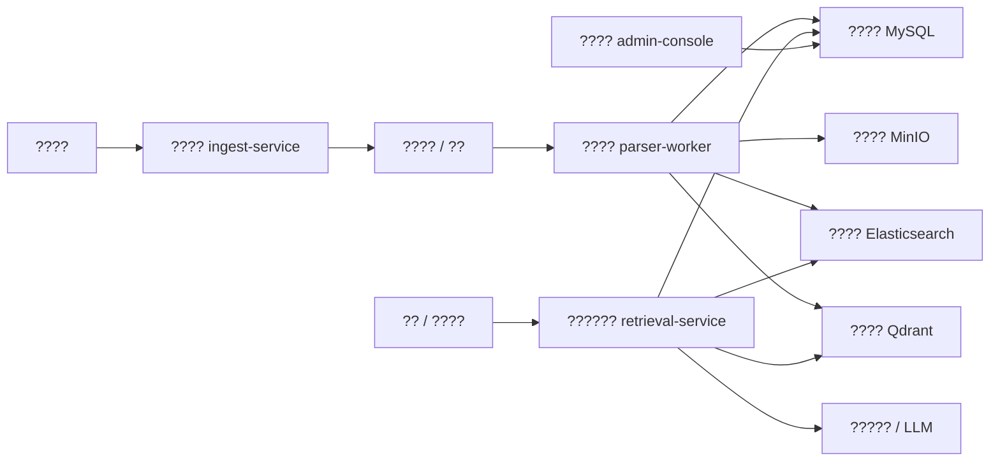

# rag-hub ????

## 1. ????

????????? `rag-hub` ???????????

- ????
- ????
- ??????
- ??????
- ????
- ????
- ??????

?????

- [????](D:/Projects/rag-hub/docs/knowledge-base-implementation-plan.md)
- [????](D:/Projects/rag-hub/docs/knowledge-base-authentication.md)
- [Host Linux ??](D:/Projects/rag-hub/docs/knowledge-base-deployment-host-linux.md)
- [Docker ??](D:/Projects/rag-hub/docs/knowledge-base-deployment-docker.md)
- [????](D:/Projects/rag-hub/docs/knowledge-base-api-spec.md)
- [DDL ????](D:/Projects/rag-hub/docs/knowledge-base-ddl-and-init.md)
- [????](D:/Projects/rag-hub/docs/knowledge-base-test-cases.md)

## 2. ????

????????????????

- ?????PDF?Word?Excel?PPT?Markdown
- ???????????????????????????????
- ?????MySQL 8.0 + Elasticsearch + Qdrant + MinIO

## 3. ??????

?????????????????

- ?????`POST /api/auth/login`
- ?????Bearer JWT
- ????????????
- ??????? `admin` ??
- ???????????????

???????????`docs/knowledge-base-authentication.md`

## 4. ??????

