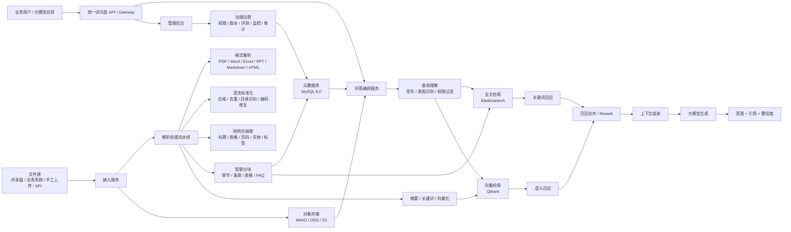

# rag-hub 实施方案

## 1. 目标

本方案用于指导当前 `rag-hub` 项目的实施与落地。系统面向文档型知识管理场景，核心目标是：

- 支持文档接入、解析、分块、索引和检索
- 支持基于引用的问答返回
- 支持版本、权限、日志和可追溯治理
- 后续可扩展图片、语音、视频等多模态内容

当前落地架构统一为：`MySQL + Elasticsearch + Qdrant + MinIO`。

## 2. 系统架构图

## 3. 核心设计原则

### 3.1 文档优先

一期以文档型知识库为中心，优先保证：

- 解析准确
- 分块合理
- 检索稳定
- 回答有引用
- 日志可回溯

### 3.2 检索与主库解耦

- MySQL 负责业务元数据和日志
- Elasticsearch 负责全文检索
- Qdrant 负责向量检索
- 向量不直接落 MySQL，只保存 `point_id` 映射

### 3.3 面向后续扩展

图片、语音、视频接入时，仍沿用：

- 元数据入 MySQL
- 文本化检索入 Elasticsearch
- embedding 入 Qdrant
- 原始对象入 MinIO

## 4. 核心模块说明

### 4.1 接入服务

职责：

- 文档上传
- 批量目录扫描
- 文件去重
- 创建文档和版本记录
- 投递解析任务

### 4.2 解析流水线

职责：

- 格式解析
- 文本清洗
- 结构抽取
- 智能分块
- 摘要和向量生成

### 4.3 元数据库

MySQL 保存：

- 文档
- 版本
- chunk 元数据
- 权限策略
- 入库任务
- 问答日志
- Qdrant 向量映射关系

### 4.4 检索层

- Elasticsearch：制度名、编号、术语、时间等精确检索
- Qdrant：语义相似检索
- 后端负责融合、排序和重排

### 4.5 问答层

- 查询改写
- 混合召回
- Rerank
- 上下文组装
- 大模型生成
- 引用输出
- 问答日志持久化

## 5. 核心数据模型

重点表：

- `kb_document`
- `kb_document_version`
- `kb_chunk`
- `kb_chunk_vector_ref`
- `kb_ingest_task`
- `kb_permission_policy`
- `kb_query_log`

关键约束：

- `kb_chunk_vector_ref` 只保存 Qdrant `point_id` 映射
- 删除、版本切换、失效操作必须同步更新 MySQL、Elasticsearch、Qdrant
- 问答日志保存原始问题、改写问题、召回结果和引用信息

## 6. 入库链路

1. 文件上传到对象存储。
2. `ingest-service` 创建文档、版本和任务。
3. `parser-worker` 认领任务并下载文件。
4. 解析文件、清洗文本、结构化抽取、分块。
5. MySQL 写文档、版本、chunk、任务状态。
6. Elasticsearch 写文本索引。
7. Qdrant 写向量。
8. `kb_chunk_vector_ref` 写向量映射。
9. 更新任务和版本最终状态。

## 7. 查询链路

1. 用户发起问题。
2. `retrieval-service` 做权限校验和查询改写。
3. Elasticsearch 做关键词召回。
4. Qdrant 做语义召回。
5. 合并结果并 rerank。
6. 组装上下文。
7. 调用大模型生成答案。
8. 返回答案、引用、置信度。
9. 持久化 `kb_query_log`。

## 8. 推荐技术栈

- 元数据库：MySQL 8.0
- 全文检索：Elasticsearch
- 向量检索：Qdrant
- 对象存储：MinIO
- 解析服务：Python
- 检索问答服务：Spring Boot
- 管理后台：可独立实现为 Web 管理端

## 9. 一期最小可用范围

一期建议最少覆盖：

- 5 类文档格式接入
- 文档上传和批量导入
- 文档解析和分块
- MySQL 元数据落库
- Elasticsearch 全文检索
- Qdrant 向量检索
- 引用式问答
- 版本和基础权限
- 日志与基本评测

## 10. 8 周实施重点

1. 完成 DDL 和初始化脚本。
2. 完成接入、文档、版本、任务落库。
3. 完成 parser-worker 的解析、分块和索引写入。
4. 完成混合检索和问答服务。
5. 完成权限、版本切换和查询日志。
6. 完成联调脚本、本地验证和部署脚本。
7. 完成 Host Linux 和 Docker 两条独立部署路径。

## 11. 后续扩展方向

- OCR 文档和扫描件
- 图片/语音/视频接入
- 更完整的 rerank 和评测体系
- 更细粒度权限控制
- 多模型或多网关大模型接入
